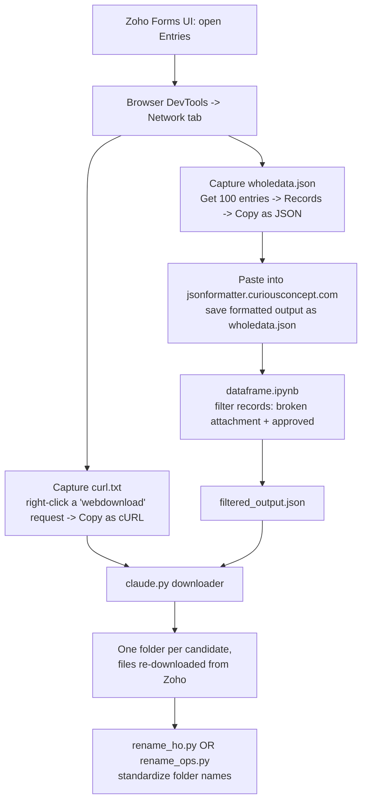

[Uploading README (1).md…]()
# Zoho HR Form — Missing Attachment Recovery Pipeline

Recovers candidate documents that got **stuck / failed to upload to Google Drive** from the
Burger Singh Zoho HR onboarding forms (**HO** and **Ops**), by pulling the files directly out
of Zoho's raw form data instead of relying on Zoho's (broken) Drive integration.

If you're new to this process, read this file top to bottom once, then use the **Quick Start**
checklist for every subsequent run.

---

## 1. Problem Statement

Burger Singh runs two Zoho onboarding forms for new joinees:

| Form | Who fills it |
|---|---|
| **HO** | Head Office joinees |
| **Ops** | Operations (restaurant/branch) joinees |

Each form has several file-upload fields (Aadhaar, PAN, photo, signature, bank proof, etc.).
Zoho is supposed to auto-push these uploaded files to a Google Drive folder per candidate.

**What was breaking:** for a subset of records, this Drive push silently failed. The candidate's
form still showed as submitted/approved, but their documents never landed in Drive. This was
invisible until HR went looking for a specific candidate's file and it wasn't there — by which
point it was hard to tell which candidates were affected.

**Goal:** reliably identify every affected record and re-download the original files straight
from Zoho, organized into one folder per candidate, without needing engineering to fix Zoho's
integration first.

---

## 2. Root Cause (short version)

Zoho tags each record with an `ATTACHMENT_SERVICE_STATUS` field. When the Drive push fails,
this field is either empty or contains an embedded `"result":"error"` payload. This status is
never surfaced anywhere in the Zoho UI — it only exists in the raw record data — which is why
the failures went unnoticed. Filtering on this field is the key to finding every broken record.

---

## 3. Solution at a Glance



**In short:** capture Zoho's raw session (`curl.txt`) and raw data (`wholedata.json`) from the
browser → filter down to only the broken records in a notebook → feed both files to a Python
downloader that re-pulls the attachments → rename the resulting folders to the agreed naming
convention.

---

## 4. Prerequisites

- Access to Zoho Forms (Entries view) for the HO and/or Ops form, logged in as an account with
  view access to submissions.
- Chrome/Edge (or any browser with DevTools).
- Python 3.10+ with:
  ```bash
  pip install pandas requests gdown
  ```
  (`json`, `re`, `csv`, `shlex`, `shutil`, `pathlib`, `urllib` are standard library — no install
  needed.)
- The two scripts in this repo:
  - `dataframe.ipynb` — filters raw Zoho data down to broken records.
  - `claude.py` — downloads files for those broken records.
  - `rename_ho.py` / `rename_ops.py` — standardizes folder names after download (see §9).

---

## 5. File Reference

| File | Purpose |
|---|---|
| `curl.txt` | A real, authenticated Zoho download request copied from the browser. Supplies the session cookie + event ID the downloader needs to pull private files. |
| `wholedata.json` | The full raw export of form entries (all records, not just broken ones), pulled via Zoho's "Copy as JSON" and reformatted. |
| `dataframe.ipynb` | Loads `wholedata.json`, filters it down to the broken/missing-attachment records, exports `filtered_output.json`. |
| `filtered_output.json` → rename to `data.json` | The filtered record list, consumed by `claude.py`. |
| `claude.py` | Downloader. Reads `data.json` + `curl.txt`, re-pulls every file per record, creates one folder per candidate. |
| `download_summary.csv` | Auto-generated by `claude.py` — one row per file, with download status. Your first stop for debugging failures. |
| `rename_ho.py` / `rename_ops.py` | Renames the downloaded candidate folders to the final naming convention (different per form — see §9). |

---

## 6. Step-by-Step Workflow

### Step 1 — Capture an authenticated request (`curl.txt`)

This gives the downloader a valid session to hit Zoho's private file endpoint with.

1. Go to **Zoho Forms → the form → Entries**.
2. Open **DevTools → Network tab**.
3. Click **Clear** on the network log (so it's easy to spot the right request).
4. Trigger any file download from within the Entries view (e.g. click an attachment).
5. In the Network tab, find the request named **`webdownload`**.
6. Right-click it → **Copy → Copy as cURL**.
7. Paste the full copied text into a file named `curl.txt` (for HO runs this is typically saved
   as `ho_curl.txt` — see `CURL_TXT_PATH` in §8).

> ⚠️ **This cURL expires.** It's tied to your live browser session/cookie. If the downloader
> later fails with HTTP 401/403, this cookie has gone stale — repeat Step 1 and re-run.

### Step 2 — Export the raw form data (`wholedata.json`)

1. Back in Entries, **Clear the network log again**.
2. Click **Get 100 entries** (or however many are needed to cover the date range you care about)
   so the records actually load and hit the network.
3. Find the resulting **Records** request in the Network tab.
4. Right-click → **Copy → Copy as JSON**.
5. Go to **https://jsonformatter.curiousconcept.com/#** and paste it in to get a validated,
   structured JSON.
6. Save/download that formatted output as `wholedata.json`, in the same working folder as
   `curl.txt`.

### Step 3 — Filter down to broken records (`dataframe.ipynb`)

Open `dataframe.ipynb` and run it top to bottom against your `wholedata.json`. The core filter is:

```python
filtered_df = df[
    (df['ATTACHMENT_SERVICE_STATUS'].isna()
     | (df['ATTACHMENT_SERVICE_STATUS'] == '')
     | df['ATTACHMENT_SERVICE_STATUS'].str.contains('"result":"error"', na=False))
    &
    (df['FORM_APPROVAL_STATUS'] == '2')
]
```

See §7 for what this means in plain English. The notebook's final cell exports the result:

```python
records = filtered_df.to_dict(orient='records')
with open(output_path, 'w', encoding='utf-8') as f:
    json.dump(records, f, ensure_ascii=False, indent=4)
```

This produces `filtered_output.json` — this is the **only** file downstream steps need; you
don't need to hand-edit `wholedata.json` further.

> 💡 The notebook also has a couple of scratch/debug cells (checking a specific candidate by
> name, re-checking the error condition alone). These aren't part of the required flow — feel
> free to ignore or delete them when adapting the notebook for a new run.

### Step 4 — Download the missing files (`claude.py`)

1. Rename `filtered_output.json` to `data.json` (or update `DATA_JSON_PATH` in the script — see
   §8) so the script picks it up.
2. Make sure `curl.txt` (or `ho_curl.txt` / `ops_curl.txt`, matching `CURL_TXT_PATH`) sits in the
   same directory.
3. Run:
   ```bash
   python claude.py
   ```
4. The script will:
   - Parse the event ID + session cookie out of your cURL.
   - Create one folder per record inside `zoho_downloads_missing/` (even if a record ends up
     having zero files, so counts stay easy to audit).
   - Try each upload field's **private Zoho path** first, and fall back to a **Google Drive
     link** (via `gdown`) if no private path exists.
   - Validate every downloaded file by its actual file signature (`%PDF`, JPEG, PNG headers, or
     rejecting anything that looks like an HTML login/error page) before saving it — so a stale
     cookie never silently saves you a folder full of login pages instead of documents.
   - Skip re-downloading files that already exist and pass validation (safe to re-run).
   - Write `download_summary.csv` with a per-file status (`Downloaded` / `Failed` /
     `Skipped_Existing_Valid`) and a final summary block in the terminal.

5. **Check the terminal output / `download_summary.csv` for failures.** If you see HTTP 401/403
   errors, your cURL cookie has expired — go back to Step 1, recopy a fresh cURL, and re-run
   (already-downloaded valid files will be skipped automatically).

### Step 5 — Standardize folder names

`claude.py` creates folders using an interim naming scheme
(`{index}__{SingleLine10}_{Dropdown4}_{SingleLine16}`) so folders are guaranteed unique and
collision-free during download. The final naming convention differs by form, so a dedicated
rename script is run afterward:

- **HO records** → run `rename_ho.py` → folders become `Name_HO`
- **Ops records** → run `rename_ops.py` → folders become `SingleLine5_dropdown4_location`

The two flows are **identical up through Step 4** — the only fork is which rename script you run
at the end, matching which form the batch came from.

---

## 7. Filter Logic Explained

```python
(df['ATTACHMENT_SERVICE_STATUS'].isna()
 | (df['ATTACHMENT_SERVICE_STATUS'] == '')
 | df['ATTACHMENT_SERVICE_STATUS'].str.contains('"result":"error"', na=False))
&
(df['FORM_APPROVAL_STATUS'] == '2')
```

A record is treated as "needs recovery" only if **both** of these are true:

1. **The Drive push looks broken** — `ATTACHMENT_SERVICE_STATUS` is either missing entirely,
   blank, or explicitly contains an error result from Zoho's attachment service.
2. **The record is actually approved** (`FORM_APPROVAL_STATUS == '2'`) — there's no point
   recovering files for a submission that was never approved in the first place.

This combination is what makes the filter reliable: status alone would also catch pending/junk
submissions; approval alone would miss the actual failures.

---

## 8. `claude.py` Config Reference

All of the knobs you'd normally touch live at the top of the file:

```python
DATA_JSON_PATH = "data.json"          # filtered record list from Step 3
CURL_TXT_PATH  = "ho_curl.txt"        # your captured cURL from Step 1
OUTPUT_DIR     = "zoho_downloads_missing"

CLEAN_OUTPUT_DIR_BEFORE_RUN = True    # wipes OUTPUT_DIR before each run — turn off if resuming a large batch
SKIP_EXISTING_VALID_FILES   = True    # safe to leave on; makes re-runs fast after a failure
```

For an **Ops** run, update `CURL_TXT_PATH` to your Ops cURL capture (e.g. `ops_curl.txt`) and
point `DATA_JSON_PATH` at the Ops-filtered JSON. Nothing else in the script needs to change —
the field names it reads (`SingleLine10`, `Dropdown4`, `SingleLine16`, etc.) come from the raw
Zoho record and are the same shape for both forms.

---

## 9. Output Structure

After Step 4:

```
zoho_downloads_missing/
├── 001__SONU GUPTA_Team Member_PVR Saket/
│   ├── aadhaar_front.pdf
│   ├── pan_card.jpg
│   └── ...
├── 002__RAMESH KUMAR_Executive_Ambience Mall/
│   └── ...
├── _debug_responses/          # raw failed responses, for diagnosing bad downloads
└── download_summary.csv
```

After Step 5 (rename), folder names change to the final convention:

| Form | Final folder naming convention | Example |
|---|---|---|
| HO | `Name_HO` | `Sonu Gupta_HO` |
| Ops | `SingleLine5_dropdown4_location` | `Sonu Gupta_Team Member_PVR Saket` |

> 📎 `rename_ho.py` / `rename_ops.py` weren't included in what was shared for this README — if
> you attach them, this section can be filled in with the exact field mapping and any edge-case
> handling (e.g. duplicate names) they implement.

---

## 10. Troubleshooting

| Symptom | Likely cause | Fix |
|---|---|---|
| Downloader fails with HTTP 401 / 403 on every file | `curl.txt` cookie expired | Recapture cURL (Step 1), re-run — existing valid files are skipped automatically |
| `download_summary.csv` shows `Zoho returned HTML/login/unauthorized page` | Same as above, caught by the response validator | Same fix |
| Folder count ≠ record count in final summary | Some records had zero upload fields, or something crashed mid-run | Check terminal log per record; folders are still created even for zero-file records, so a mismatch means the run didn't finish cleanly |
| Drive fallback fails with "Rate Limited / Quota Exceeded" | `gdown` hitting Google's anonymous download rate limit | Re-run later; script already sleeps 4–8s between Drive downloads to reduce this |
| A file downloads but is corrupted/unreadable | Signature validation should have caught this and marked it `Failed` — check `_debug_responses/` for the raw saved response | Re-run after refreshing the cURL |
| `FileNotFoundError: Could not find data.json` | Forgot to rename `filtered_output.json` → `data.json`, or `DATA_JSON_PATH` doesn't match | Rename the file or update the config (§8) |

---

## 11. Quick Start Checklist (for repeat runs)

- [ ] Open Zoho Entries → capture fresh `curl.txt` (webdownload request → Copy as cURL)
- [ ] Capture `wholedata.json` (Get 100 entries → Records → Copy as JSON → format via jsonformatter)
- [ ] Run `dataframe.ipynb` → produces `filtered_output.json`
- [ ] Rename `filtered_output.json` → `data.json`
- [ ] Confirm `DATA_JSON_PATH` / `CURL_TXT_PATH` in `claude.py` match your files (and the form: HO vs Ops)
- [ ] `python claude.py`
- [ ] Check `download_summary.csv` for any `Failed` rows — refresh cURL and re-run if needed
- [ ] Run `rename_ho.py` (HO) or `rename_ops.py` (Ops) to finalize folder names
